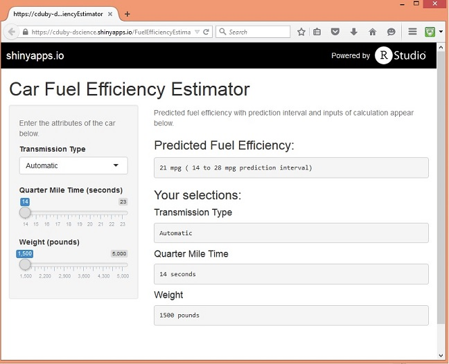

## Introduction

* Market Demands Drive Greater Car Fuel Efficiency

    * Government requirements i.e. [CAFE](https://en.wikipedia.org/wiki/Corporate_Average_Fuel_Economy)
    * Environmentally Aware Consumers
    * Competitive Advantage
    
* Car Fuel Efficiency Estimator
    * Input Transmission Type, Weight, and Quarter Mile Time
    * Predicts fuel efficiency range using linear regression
    
* Applications - Car Design and Evaluation
    * How fast can I make the car and still meet required fuel effiency?
    * Is actual car fuel efficiency within predicted range?

--- .class #id 
## Car Fuel Efficiency Estimator
https://cduby-dscience.shinyapps.io/FuelEfficiencyEstimator


--- .class #id 

## Instructions
* Input car attributes on left side of screen
    * Select Transmission type, Weight and Quarter Mile Time
* Fuel Efficency Estimation displayed in upper right of screen
    * Predict car fuel efficency and 95% prediction interval

--- .class #id 

## Linear Regression Model
```{r}
data(mtcars)
model <- lm(mpg ~ factor(am) + wt + qsec, mtcars)
```

```{r, results='asis', echo=FALSE}
library(knitr)
kable(summary(model)$coef)
```


