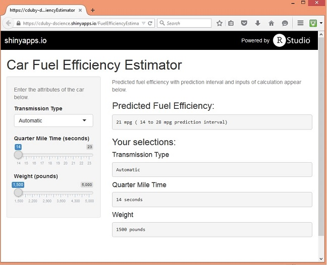

## Introduction

* Market Demands Drive Greater Car Fuel Efficiency

    * Government requirements i.e. [CAFE](https://en.wikipedia.org/wiki/Corporate_Average_Fuel_Economy)
    * Environmentally Aware Consumers
    * Competitive Advantage
    
* Car Fuel Efficiency Estimator
    * Input Transmission Type, Weight, and Quarter Mile Time
    * Predicts fuel efficiency range using linear regression
    
* Applications - Car Design and Evaluation
    * How fast can I make the car and still meet required fuel effiency?
    * Is actual car fuel efficiency within predicted range?

--- .class #id 
## Car Fuel Efficiency Estimator
https://cduby-dscience.shinyapps.io/FuelEfficiencyEstimator


--- .class #id 

## Instructions
* Input car attributes on left side of screen
    * Select Transmission type, Weight and Quarter Mile Time
* Fuel Efficency Estimation displayed in upper right of screen
    * Predict car fuel efficency and 95% prediction interval

--- .class #id 

## Linear Regression Model

```r
data(mtcars)
model <- lm(mpg ~ factor(am) + wt + qsec, mtcars)
```


|            |  Estimate| Std. Error|   t value| Pr(>&#124;t&#124;)|
|:-----------|---------:|----------:|---------:|------------------:|
|(Intercept) |  9.617781|  6.9595930|  1.381946|          0.1779152|
|factor(am)1 |  2.935837|  1.4109045|  2.080819|          0.0467155|
|wt          | -3.916504|  0.7112016| -5.506882|          0.0000070|
|qsec        |  1.225886|  0.2886696|  4.246676|          0.0002162|


